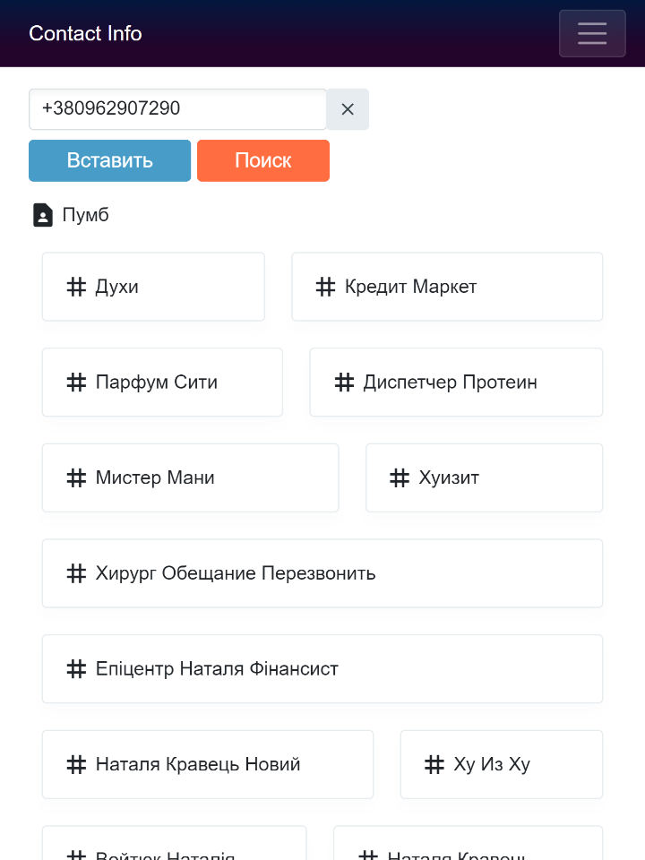

# ContactInfoApp
SPA (Single Page Application) for finding info about user by phone number using GetContact API.

## Used APIs, Frameworks and Libraries
  * GetContact API
  * ASP.NET Core 7.0 (Web API)
  * Entity Framework Core 7.0 with SQLite
  * Blazor WebAssembly 7.0
  * Radzen.Blazor
  * Microsoft.Azure.CognitiveServices.Vision.ComputerVision
  
## Main Page

 

